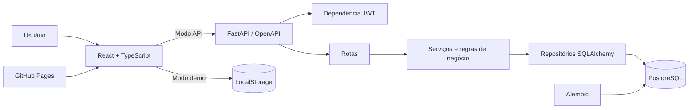
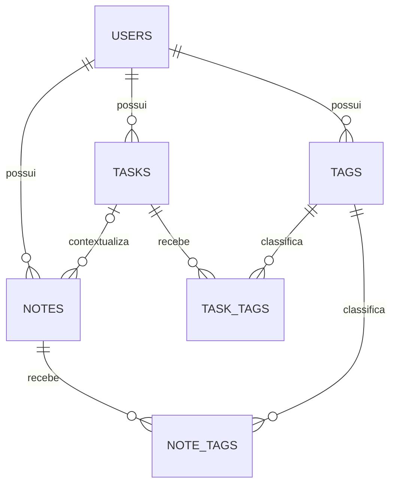

# TaskNote — Gerenciador de Tarefas e Anotações

[](https://www.python.org/)
[](https://react.dev/)
[](https://fastapi.tiangolo.com/)
[](https://www.postgresql.org/)
[](https://github.com/DanielRobertoRibeiro/TaskNote/actions/workflows/ci.yml)
[](LICENSE)

**[Abrir a demonstração no GitHub Pages](https://danielrobertoribeiro.github.io/TaskNote/)**

Aplicação full-stack para organizar tarefas e anotações em um único lugar. O projeto reúne uma interface React responsiva, API FastAPI, autenticação JWT, autorização por proprietário, tags, filtros, busca textual, paginação e documentação OpenAPI em uma base pronta para portfólio e evolução.

> Estado do projeto: MVP full-stack concluído. São 17 testes de backend com 93,70% de cobertura e 2 testes unitários do frontend, todos aprovados na validação local de 18/09/2026.

## O que foi entregue

- Cadastro e autenticação com JWT e expiração configurável.
- Senhas protegidas com Argon2; nenhum endpoint devolve o hash.
- CRUD completo de tarefas e anotações.
- Status `pendente`, `em_andamento` e `concluida`.
- Prioridades `baixa`, `media` e `alta`.
- Registro automático de `completed_at` em UTC e remoção ao reabrir.
- Notas independentes ou vinculadas a uma tarefa.
- Preservação da nota com `task_id = null` quando a tarefa é excluída.
- Tags únicas por usuário sem diferenciar maiúsculas e minúsculas.
- Filtros, busca textual e paginação com limite configurável.
- Isolamento de dados: recursos de outro usuário respondem como não encontrados.
- Erros em formato uniforme e rastreáveis por `X-Request-ID`.
- Health check da aplicação e da conexão com o banco.
- Migrações Alembic, Docker Compose, CI e coleção Postman.
- Dashboard React/TypeScript com telas de acesso, visão geral, tarefas, anotações e tags.
- Interface adaptada para desktop, tablet e celular, com validação visual em navegador.
- Modo demonstração persistido no navegador e integração real configurável com a API.
- Publicação automática no GitHub Pages por GitHub Actions.

## Arquitetura



As responsabilidades foram separadas para que transporte HTTP, negócio e persistência possam evoluir e ser testados sem acoplamento desnecessário:

- `api`: rotas e dependências HTTP;
- `schemas`: contratos Pydantic de entrada e saída;
- `services`: regras de negócio e autorização contextual;
- `repositories`: consultas e persistência SQLAlchemy;
- `db`: modelos, sessão e metadados;
- `core`: configuração, segurança, enums e exceções.

### Modelo relacional



## Tecnologias

| Área | Escolha | Uso |
| --- | --- | --- |
| Frontend | React 19 + TypeScript 7 | Interface e contratos tipados |
| Build web | Vite 8 | Desenvolvimento e bundle otimizado |
| Ícones | Lucide React | Iconografia acessível e consistente |
| Linguagem | Python 3.12+ | Tipagem moderna e regras da aplicação |
| API | FastAPI + Uvicorn | Rotas, validação e OpenAPI |
| Dados | PostgreSQL 17 | Banco relacional de produção |
| ORM | SQLAlchemy 2 | Mapeamento e consultas |
| Migração | Alembic | Versionamento do schema |
| Segurança | PyJWT + pwdlib/Argon2 | Tokens e hash de senha |
| Configuração | pydantic-settings | Variáveis de ambiente |
| Testes | pytest + HTTPX + SQLite | Testes rápidos de integração |
| Qualidade | Ruff + coverage.py | Lint, formatação e cobertura |
| Operação | Docker Compose + Nginx | Web, API e banco reproduzíveis |
| Deploy web | GitHub Pages | Hospedagem estática do React |
| CI/CD | GitHub Actions | Qualidade, build e publicação automática |

O inventário com versões validadas, arquivos, decisões, controles e limitações está em [docs/INVENTARIO_TECNICO.md](docs/INVENTARIO_TECNICO.md).

## Início rápido com Docker

Pré-requisitos: Docker Engine com Docker Compose v2 e Git.

```bash
git clone https://github.com/DanielRobertoRibeiro/TaskNote.git
cd TaskNote
cp .env.example .env
docker compose up --build
```

No PowerShell, substitua a cópia por:

```powershell
Copy-Item .env.example .env
docker compose up --build
```

O entrypoint aplica `alembic upgrade head` antes de iniciar a API. Depois, acesse:

- Aplicação React: `http://localhost:3000`
- Swagger UI: `http://localhost:8000/docs`
- ReDoc: `http://localhost:8000/redoc`
- OpenAPI JSON: `http://localhost:8000/openapi.json`
- Health check: `http://localhost:8000/api/v1/health`

Para encerrar:

```bash
docker compose down
```

Para também apagar o volume local do PostgreSQL, use `docker compose down -v`. Esse segundo comando remove os dados persistidos.

## Execução local

### Backend

Pré-requisitos: Python 3.12+, PostgreSQL e uma base criada.

```bash
python -m venv .venv
```

Linux/macOS:

```bash
source .venv/bin/activate
pip install -r requirements-dev.txt
cp .env.example .env
```

Windows PowerShell:

```powershell
.\.venv\Scripts\Activate.ps1
python -m pip install -r requirements-dev.txt
Copy-Item .env.example .env
```

Edite `DATABASE_URL` e `SECRET_KEY` no `.env`, então execute:

```bash
alembic upgrade head
uvicorn app.main:app --reload
```

Uma chave pode ser gerada sem serviço externo:

```bash
python -c "import secrets; print(secrets.token_urlsafe(48))"
```

### Frontend

Pré-requisitos: Node.js 24+ e pnpm 11+.

```bash
cd frontend
pnpm install
pnpm dev
```

A interface estará em `http://localhost:5173`. Ela pode usar os dados demonstrativos locais ou conectar-se à FastAPI em `http://localhost:8000`. O endereço também pode ser alterado na própria tela de acesso.

## Configuração

| Variável | Padrão de desenvolvimento | Descrição |
| --- | --- | --- |
| `APP_NAME` | `TaskNote` | Nome exibido no OpenAPI |
| `APP_VERSION` | `1.0.0` | Versão exposta pelo health check |
| `ENVIRONMENT` | `development` | Ambiente atual |
| `DEBUG` | `false` | Nível de log detalhado |
| `API_V1_PREFIX` | `/api/v1` | Prefixo das rotas |
| `DATABASE_URL` | PostgreSQL local | URL SQLAlchemy/psycopg |
| `SECRET_KEY` | somente desenvolvimento | Chave de assinatura JWT; troque em produção |
| `JWT_ALGORITHM` | `HS256` | Algoritmo do token |
| `ACCESS_TOKEN_EXPIRE_MINUTES` | `60` | Duração do acesso |
| `PAGINATION_DEFAULT_SIZE` | `20` | Tamanho padrão da página |
| `PAGINATION_MAX_SIZE` | `100` | Limite aceito por requisição |
| `CORS_ORIGINS` | origens locais | Lista JSON de origens permitidas |

A aplicação recusa o segredo padrão se `ENVIRONMENT` não for `development` ou `test`.

O build do frontend aceita:

| Variável | Padrão | Descrição |
| --- | --- | --- |
| `VITE_API_URL` | `http://localhost:8000` | Endereço público da FastAPI |
| `VITE_BASE_PATH` | `/` | Caminho base; no Pages é `/TaskNote/` |

## Contrato da API

Todas as rotas, exceto cadastro, login e saúde, exigem:

```http
Authorization: Bearer <access_token>
```

| Método | Rota | Função |
| --- | --- | --- |
| `POST` | `/api/v1/auth/register` | Criar usuário |
| `POST` | `/api/v1/auth/login` | Emitir JWT |
| `POST` | `/api/v1/tasks` | Criar tarefa |
| `GET` | `/api/v1/tasks` | Listar, buscar e filtrar tarefas |
| `GET` | `/api/v1/tasks/{id}` | Consultar tarefa |
| `PATCH` | `/api/v1/tasks/{id}` | Editar tarefa |
| `PATCH` | `/api/v1/tasks/{id}/status` | Alterar status |
| `DELETE` | `/api/v1/tasks/{id}` | Excluir tarefa |
| `POST` | `/api/v1/notes` | Criar anotação |
| `GET` | `/api/v1/notes` | Listar, buscar e filtrar anotações |
| `GET` | `/api/v1/notes/{id}` | Consultar anotação |
| `PATCH` | `/api/v1/notes/{id}` | Editar, vincular ou desvincular |
| `DELETE` | `/api/v1/notes/{id}` | Excluir anotação |
| `POST` | `/api/v1/tags` | Criar tag |
| `GET` | `/api/v1/tags` | Listar tags |
| `DELETE` | `/api/v1/tags/{id}` | Excluir tag e associações |
| `GET` | `/api/v1/health` | Verificar API e banco |

### Fluxo mínimo

Cadastre um usuário:

```bash
curl -X POST http://localhost:8000/api/v1/auth/register \
  -H "Content-Type: application/json" \
  -d '{"name":"Daniel Ribeiro","email":"daniel@example.com","password":"senha-segura-123"}'
```

Obtenha o token:

```bash
curl -X POST http://localhost:8000/api/v1/auth/login \
  -H "Content-Type: application/json" \
  -d '{"email":"daniel@example.com","password":"senha-segura-123"}'
```

Crie uma tarefa usando o `access_token` retornado:

```bash
curl -X POST http://localhost:8000/api/v1/tasks \
  -H "Authorization: Bearer SEU_TOKEN" \
  -H "Content-Type: application/json" \
  -d '{
    "title":"Preparar apresentação",
    "description":"Revisar conteúdo e ensaiar a demonstração.",
    "priority":"alta",
    "due_at":"2026-09-25T18:00:00Z",
    "tag_ids":[]
  }'
```

### Filtros

Tarefas aceitam `status`, `priority`, `tag`, `overdue`, `due_before`, `due_after`, `q`, `page` e `page_size`:

```http
GET /api/v1/tasks?status=pendente&priority=alta&tag=faculdade&overdue=false&due_before=2026-09-30&q=apresentacao&page=1&page_size=20
```

Anotações aceitam `task_id`, `unlinked`, `tag`, `q`, `page` e `page_size`:

```http
GET /api/v1/notes?unlinked=true&tag=referencia&q=arquitetura&page=1&page_size=20
```

Datas de criação/edição e `completed_at` usam UTC. `due_at` exige fuso horário; os filtros de prazo recebem datas no formato `AAAA-MM-DD`.

### Paginação

```json
{
  "items": [],
  "total": 0,
  "page": 1,
  "page_size": 20,
  "pages": 0
}
```

### Erros

Erros não expõem detalhes internos e seguem a mesma estrutura:

```json
{
  "error": {
    "code": "validation_error",
    "message": "Dados inválidos.",
    "details": []
  },
  "request_id": "a0e7fa2d-5d74-40ab-8844-b9ae64dd47bc"
}
```

O identificador também é devolvido no cabeçalho `X-Request-ID` e pode ser enviado pelo cliente para correlação.

## Testes e qualidade

```bash
pytest --cov=app --cov-report=term-missing
ruff check .
ruff format --check .
alembic upgrade head --sql

cd frontend
pnpm test
pnpm build
```

Validação local registrada:

```text
Backend: 17 testes aprovados · cobertura 93,70%
Frontend: 2 testes aprovados
TypeScript + Vite: build de produção aprovado
Ruff e migração SQL offline: aprovados
Inspeção visual: acesso, dashboard, tarefas, notas, tags e modal aprovados
```

Os testes usam SQLite em memória apenas como infraestrutura efêmera. A aplicação e as migrações de produção usam PostgreSQL.

## Segurança implementada

- Hash Argon2 com sal por senha.
- JWT assinado com tempo de expiração.
- Segredos e banco configurados por ambiente.
- Resposta `404` para um identificador pertencente a outro usuário.
- Validação de propriedade também para tags e vínculos nota–tarefa.
- Validação de tamanho, formato, enums e timezone.
- Respostas sem senha, hash, token de banco ou stack trace.
- Usuário não privilegiado no container.
- Consultas parametrizadas pelo SQLAlchemy.
- CI com permissões somente de leitura.

Para um ambiente público, ainda são recomendados HTTPS no proxy, rotação de segredo, rate limiting, refresh tokens/revogação, observabilidade externa, backup e varredura de dependências.

## Estrutura do projeto

```text
TaskNote/
├── .github/workflows/
│   ├── ci.yml
│   └── pages.yml
├── alembic/
│   └── versions/20260917_0001_initial_schema.py
├── app/
│   ├── api/
│   ├── core/
│   ├── db/
│   ├── repositories/
│   ├── schemas/
│   ├── services/
│   └── main.py
├── docs/
│   └── INVENTARIO_TECNICO.md
├── frontend/
│   ├── src/
│   │   ├── components/
│   │   ├── lib/
│   │   ├── views/
│   │   └── App.tsx
│   ├── Dockerfile
│   ├── nginx.conf
│   └── package.json
├── postman/
│   └── TaskNote.postman_collection.json
├── tests/
├── .env.example
├── alembic.ini
├── docker-compose.yml
├── Dockerfile
├── pyproject.toml
├── requirements.txt
└── requirements-dev.txt
```

## Decisões importantes

- UUIDs evitam IDs sequenciais expostos e facilitam integrações futuras.
- `normalized_name` materializa a identidade canônica de tags e permite unicidade no banco.
- `ON DELETE SET NULL` garante no próprio schema a preservação das anotações.
- Serviços concentram regras e repositórios concentram SQL, reduzindo lógica nas rotas.
- Operações síncronas são adequadas ao escopo do MVP e mantêm o fluxo simples; uma migração assíncrona pode ser avaliada sob carga medida.
- O contrato usa login JSON e segurança HTTP Bearer, tornando o consumo direto e a autorização pelo Swagger simples.
- O frontend usa um contrato de serviço único com adaptadores para FastAPI e demonstração local.
- O Pages publica apenas a interface estática; o modo demonstração garante uma experiência navegável sem expor credenciais ou exigir backend público.

## Critérios de aceite do SDD

- [x] Registro e login com JWT.
- [x] CRUD, status, prioridade, prazo e tags em tarefas.
- [x] CRUD e vínculo opcional em anotações.
- [x] Filtros, busca e paginação.
- [x] Isolamento entre usuários.
- [x] Hash seguro de senhas.
- [x] Migração inicial Alembic.
- [x] OpenAPI em `/docs`.
- [x] Testes automatizados dos fluxos críticos.
- [x] Execução local e Docker Compose documentadas.
- [x] Interface React responsiva integrada à API.
- [x] Demonstração estática publicável no GitHub Pages.

## Próximas evoluções

- Quadro Kanban com arrastar e soltar.
- Refresh tokens e revogação de sessões.
- Lembretes e notificações.
- Compartilhamento controlado de listas.
- Anexos, links e busca textual avançada do PostgreSQL.
- Integração com calendário.
- Métricas, tracing e dashboard operacional.

## Deploy no GitHub Pages

O workflow [`.github/workflows/pages.yml`](.github/workflows/pages.yml) testa, compila e publica `frontend/dist` a cada alteração do frontend na branch `main`.

- URL: `https://danielrobertoribeiro.github.io/TaskNote/`
- Base do Vite: `/TaskNote/`
- Node.js: 24
- Gerenciador: pnpm 11 com lockfile congelado
- Fonte do Pages: GitHub Actions, habilitada automaticamente pelo workflow

Sem uma API pública configurada, use **Explorar demonstração**. Para conectar uma FastAPI hospedada, crie a variável de repositório `VITE_API_URL` com a URL HTTPS e inclua a origem `https://danielrobertoribeiro.github.io` em `CORS_ORIGINS` no backend.

## Coleção Postman

Importe [postman/TaskNote.postman_collection.json](postman/TaskNote.postman_collection.json). A coleção usa `http://localhost:8000` por padrão, guarda automaticamente o token e reaproveita IDs de tag, tarefa e anotação entre as requisições.

## Licença

Distribuído sob a [licença MIT](LICENSE).

Desenvolvido por [Daniel Roberto Ribeiro](https://github.com/DanielRobertoRibeiro).
